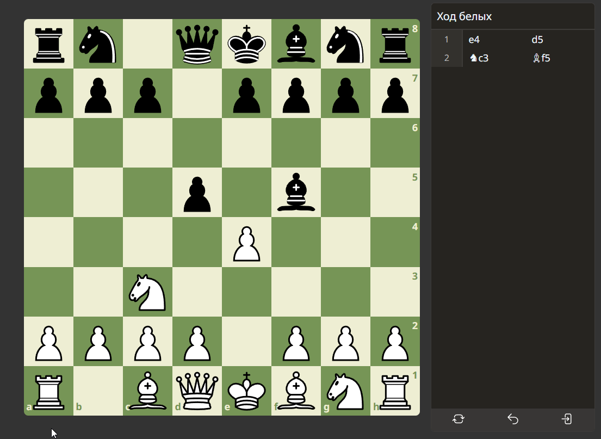
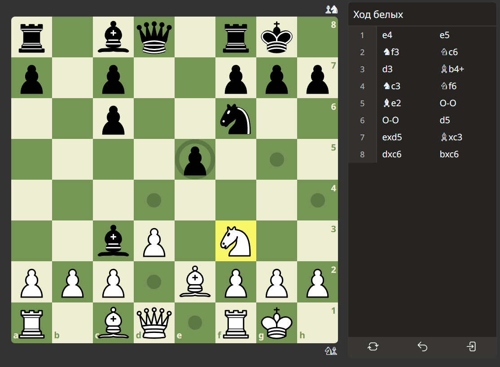

### React Chess App
A modern chess game built with React, Vite, and chess.js. Features a clean UI, move validation, game history, and more.

#### Features:
- ♟️ Full chess rules enforcement using chess.js

- 🔄 Move history navigation (undo)

- 🎨 Responsive and clean UI

- ♻️ Highlight legal moves

- 📱 Mobile-friendly design

---

